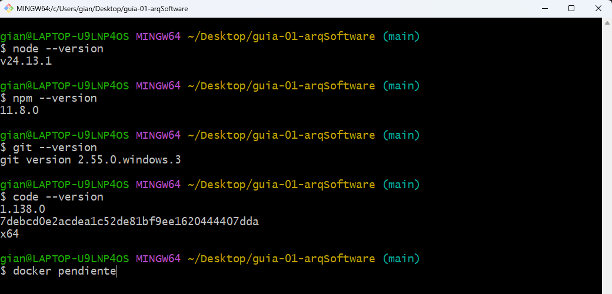
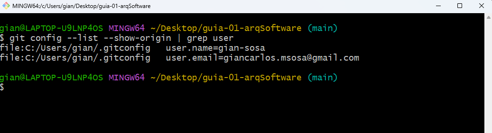
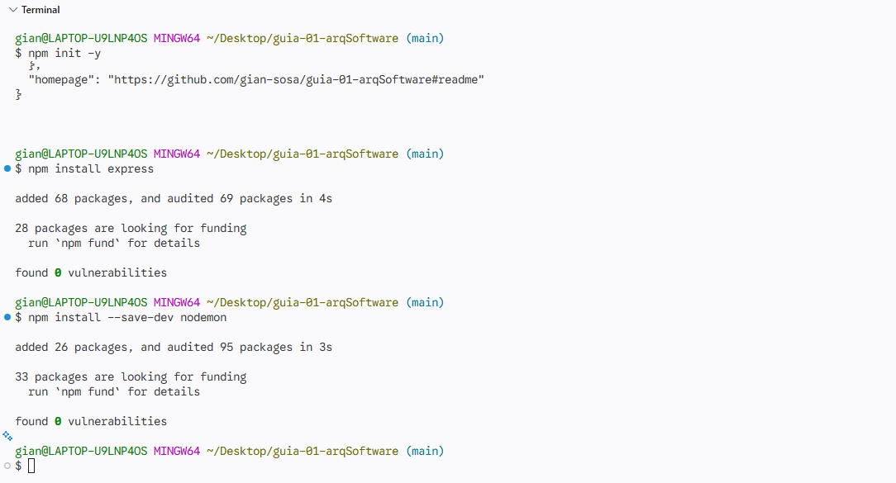
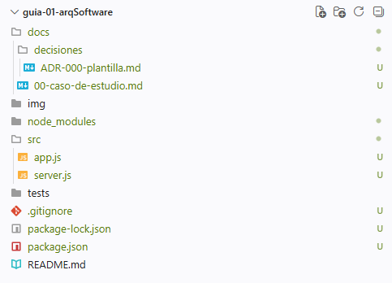

# 📚 Arquitetura de Software IS-488

## 👨‍🎓 Datos generales

| Información | Detalle |
|---|---|
| **Estudiante** | Gian Carlos Mallqui Sosa |
| **Carrera** | Ingeniería de Sistemas |
| **Universidad** | Universidad Nacional de San Cristóbal de Huamanga |
| **Periodo académico** | 2026-II |
| **Docente** | Ing. LIZBETH JAICO QUISPE |

---

## 📖 Descripción del curso

El curso de **Arquitectura de Software** tiene como finalidad desarrollar conocimientos teóricos y prácticos sobre el diseño, estructuración y organización de sistemas de software, abordando patrones arquitectónicos, principios de diseño y buenas prácticas que permitan construir soluciones escalables, mantenibles, seguras y eficientes para resolver problemas reales de la Ingeniería de Sistemas.

---

## 🎯 Expectativas del estudiante

| Expectativa | Descripción |
|---|---|
| **Diseño de sistemas** | Comprender cómo diseñar y estructurar arquitecturas de software sólidas y eficientes. |
| **Patrones arquitectónicos** | Conocer y aplicar diferentes patrones y estilos arquitectónicos según las necesidades de cada sistema. |
| **Buenas prácticas** | Fortalecer el uso de principios y buenas prácticas para desarrollar software mantenible, escalable y seguro. |
| **Aplicación práctica** | Aplicar los conocimientos adquiridos en proyectos reales y académicos de Ingeniería de Sistemas. |
| **Desarrollo profesional** | Mejorar mi capacidad para tomar decisiones técnicas y proponer soluciones arquitectónicas adecuadas. |

---

## 📝 Evidencias Ejercicio 1

### Paso 1 - Verificar versiones

  

### Paso 2 - Configurar tu identidad en Git

  

---

## 📝 Evidencias Ejercicio 2

### Paso 1 - Crear el proyecto

  

### Paso 2 - Crear la estructura de carpetas

  

---